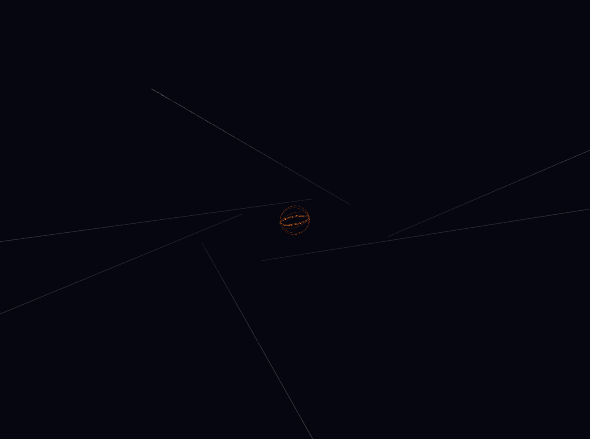
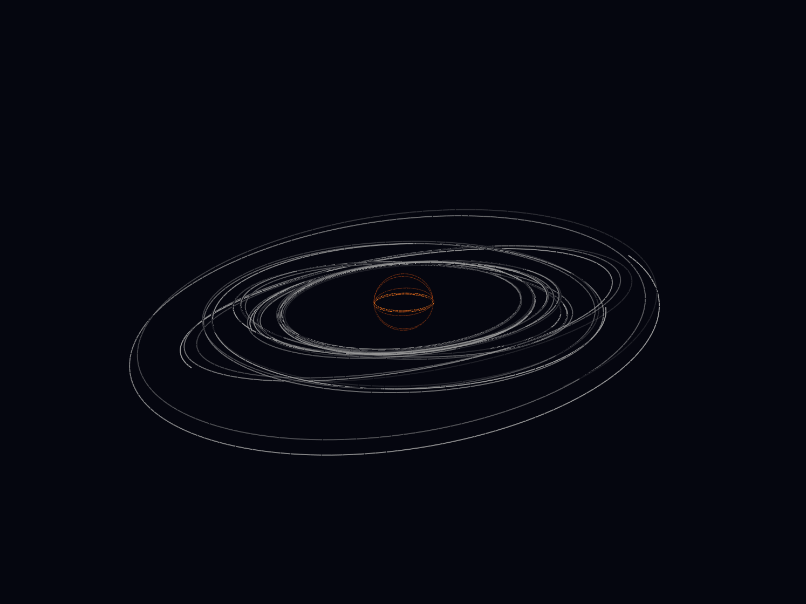
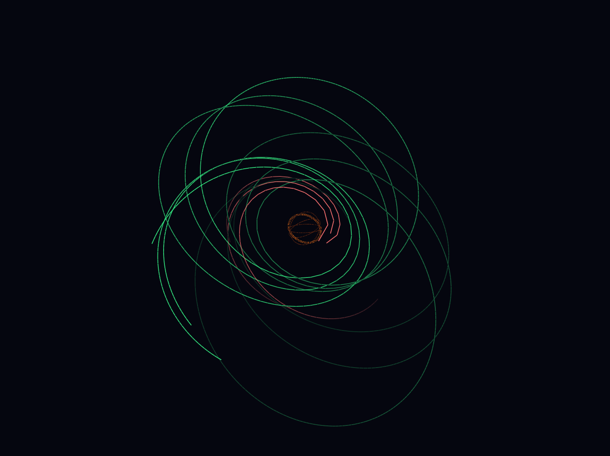

# General Relativity Engine

This project implements the motion of particles in different space-time geometries and provides GPU-accelerated visualization using **PyTorch** and **VisPy**.

The engine numerically integrates geodesics in curved space-time and visualizes the resulting trajectories in three-dimensional space.

---

## Implemented Metrics

The project currently includes several important metrics of relativity:

* **Minkowski metric** — flat space-time of special relativity;
* **Schwarzschild metric** — static spherically symmetric black hole;
* **Kerr metric** — rotating black hole.

Each metric defines the geometry of space-time through the line element

```math
ds^2 = g_{\mu\nu}dx^\mu dx^\nu.
```

---

## Christoffel Symbols

For every metric, the corresponding Christoffel symbols are computed automatically using PyTorch automatic differentiation.

The Christoffel symbols are defined by

```math
\Gamma^\mu_{\nu\rho}
=
\frac12
g^{\mu\sigma}
\left(
\partial_\nu g_{\sigma\rho}
+
\partial_\rho g_{\sigma\nu}
-
\partial_\sigma g_{\nu\rho}
\right).
```

These quantities describe the connection of the manifold and determine how trajectories are influenced by the curvature of space-time.

---

## Geodesics

Particle trajectories are obtained by solving the geodesic equation

```math
\frac{d^2x^\mu}{d\lambda^2}
+
\Gamma^\mu_{\nu\rho}
\frac{dx^\nu}{d\lambda}
\frac{dx^\rho}{d\lambda}
=
0.
```

The numerical integration is performed using the fourth-order Runge–Kutta method (RK4).

---

## Visualization

After integration, the resulting trajectories are rendered in three-dimensional space using **VisPy** with GPU acceleration.

The overall pipeline of the engine is

```text
Metric
   ↓
Christoffel Symbols
   ↓
Geodesics
   ↓
Trajectories
   ↓
GPU Visualization
```

or, in compact form,

```text
Metric → Christoffel → Geodesic → Trajectory
```

---

## Examples

Minkowski:


Schwarzschild:


Kerr:


---

## Main Technologies

* PyTorch
* Automatic Differentiation
* Tensor Calculus
* Differential Geometry
* General Relativity
* VisPy
* GPU Acceleration
